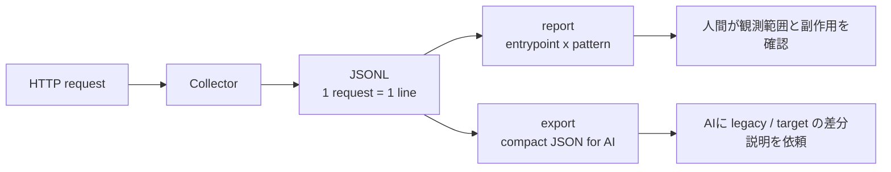

# tekagami-php

> [!NOTE]
> このライブラリは実験中になります。

稼働中の PHP ウェブアプリの HTTP リクエスト振る舞いを観測し、1リクエスト1行の JSONL（`tekagami-v1`）として記録するライブラリ。

**目的**: 仕様調査・移行調査のための「証拠データ」生成。分析・要約は AI や外部ツールに委ねる。

- フレームワーク非依存・PHP 7.0 以上・Composer 配布
- APM ではない（速度・レイテンシは測らない）
- デフォルトで全値を shape（型構造）に変換（実値は出さない）。実値は白リスト（`keepKeys` / `sqlValueAllowlist`）で明示したものだけ残す
- HTTP ヘッダは存在情報も含めて白リスト（`keepHeaderKeys`）で明示したものだけ残す
- HMAC 方式のトークン化で「同一値の追跡」を実値なしで可能に
- 書き込み失敗はアプリに伝播しない

## 全体像



JSONL には HTTP 入出力の shape、SQL の時系列、custom イベント、errors、effects が入ります。`report` はエントリポイントと実行パターンを人間向けに集計し、`export` はSQL全文を辞書化して AI に渡しやすい小さな JSON にします。

`app_name` / `env` は JSONL には入れません。`legacy-shop.production.jsonl` や `ci3-demo-shop.local-e2e.jsonl` のようにファイル名・保存パスで管理します。

## インストール

```bash
composer require coffee-r/tekagami-php
```

> 動作要件は PHP 7.0 以上。テストの実行は PHP 7.3 以上（dev 依存の PHPUnit ^9.5 が要求）。

## 基本的な使い方

```php
use CoffeeR\Tekagami\Collector;
use CoffeeR\Tekagami\Config;
use CoffeeR\Tekagami\Flow;
use CoffeeR\Tekagami\Http\HttpInput;
use CoffeeR\Tekagami\Http\HttpResponse;
use CoffeeR\Tekagami\Sink\JsonlSink;
use CoffeeR\Tekagami\Sql\SqliteSqlAnalyzer;

// Controllerの基底クラスのConstructorなど、1リクエスト単位で設定します
$collector = new Collector(
    new Config(getenv('TEKAGAMI_SECRET') ?: null),
    new JsonlSink('/var/log/tekagami/your-app-name.production.today-yyyymmdd.jsonl'), // JSONL ファイルへ書き出し
    new SqliteSqlAnalyzer()                                      // SQL 方言は必須・明示注入
);

// Httpレベルのリクエスト情報を指定します。
$http = new HttpInput($yourRequest->method(), $yourRequest->path());
$http->queryRaw          = $yourRequest->query();        // CI3: $this->input->get()  | Laravel: $request->query()
$http->requestRaw        = $yourRequest->requestBody();  // CI3: json_decode($this->input->raw_input_stream, true) | Laravel: $request->all()
$http->requestHeadersRaw = $yourRequest->headers();      // CI3: $this->input->request_headers() | Laravel: $request->headers->all()
$http->pathPattern       = '/products/{id}';             // フレームワークのルート定義などから

// これ以降、後続の証拠データ追加メソッドが使えます。
// flow を指定しない場合、flow_id / seq は null として記録されます。
$collector->start($http);

// 開発・QA の調査で明示的な相関が必要な場合だけ Flow を渡します。
// $collector->start($http, new Flow('qa-order-cod-001', 1));

// SQL
$collector->addSql($db->last_query(), [], 'query_history');

// カスタム（キャッシュ・外部 API など）
$collector->addCustom('cache_read', ['key' => $cacheKey, 'hit' => $hit]);

// Httpレベルのレスポンス情報を指定します。
$response               = new HttpResponse();
$response->status       = http_response_code();
$response->responseKind = 'json';
$response->responseBodyRaw = $responseData;

// Controllerの基底クラスのDestructorやテンプレートファイルに変数を渡す直前などに差し込みます。
// このメソッドで指定したJSONLに書き込まれます。
$collector->finish($response);
```

## 設定オプション（Config）

コンストラクタ: `new Config($secret = null, array $options = [])`

`$secret` は第1引数（位置引数）、それ以外は `$options` 配列で渡す。

| オプション | 型 | デフォルト | 説明 |
|---|---|---|---|
| `secret` *(第1引数)* | string\|null | null | HMAC-SHA256 の共有シークレット。設定時に `*_tokens` フィールドを記録。null = トークン化なし |
| `keepKeys` | array | `[]` | 実値を残すキー名の白リスト（query/body、完全一致・大小無視）。空 = 実値を一切残さない |
| `keepHeaderKeys` | array | `[]` | 記録するHTTPヘッダ名の白リスト（完全一致・大小無視）。空 = ヘッダの存在情報も記録しない |
| `sqlValueAllowlist` | array | `[]` | SQL の実値を残す列名の白リスト（`'table.column'` または `'column'`） |
| `captureText` | bool | false | 生 SQL テキストを `statement_text` に保存（**平文**・開発用。本番非推奨） |
| `captureEffects` | bool | true | INSERT/UPDATE/DELETE の集計を `effects[]` に出力 |
| `tokenHmacLength` | int | 12 | `*_tokens` フィールドの HMAC-SHA256 hex 桁数 |
| `maxDepth` | int | 10 | shape 生成の再帰深さ上限 |
| `maxShapeNodes` | int | 10000 | shape 生成のノード訪問数上限（メモリ対策） |
| `maxTimelineSize` | int\|null | 500 | timeline イベント数上限。超過で以降を無視し `errors[]` に記録（null = 無制限） |

`sqlValueAllowlist` は実行済み SQL 文字列から正規表現ベースで値を拾う best-effort 機能です。単純な `INSERT ... VALUES (...)`、`UPDATE ... SET ...`、`WHERE col = value` などを対象にしており、関数呼び出し、カンマを含む文字列、複雑なサブクエリ、DB 方言固有のリテラルでは抽出できないことがあります。抽出できない場合も観測自体は失敗扱いにせず、`statement_normalized` と shape を主な証拠として残します。

採取対象を絞る場合は、フレームワーク側の差し込み箇所や環境設定で Collector を呼ぶ範囲を制御します。このライブラリは仕様・移行調査用の証拠採取が目的で、低頻度の分岐やエッジケースを落とさないことを優先します。

## SQL 方言の選択

SQL の正規化・テーブル抽出・トークン化は RDBMS の方言ごとに挙動が変わる（文字列リテラルの `''` エスケープ、識別子クォート、Oracle の `q'[...]'` / `N'...'` / `FROM dual` / dblink、SQLite の `[ident]` など）。アナライザは **`Collector` の第3引数で明示注入する**（必須・null 不可）。同梱は `OracleSqlAnalyzer` / `SqliteSqlAnalyzer` の 2 種。

```php
$collector = new Collector(
    new Config(getenv('TEKAGAMI_SECRET') ?: null),
    new JsonlSink('/var/log/tekagami/legacy-shop.production.jsonl'),
    new OracleSqlAnalyzer()   // または new SqliteSqlAnalyzer()
);
```

注入したアナライザは各 SQL イベントの `analysis.dialect`（`oracle` / `sqlite`）に記録される。

他の RDBMS（PostgreSQL/MySQL/SQLServer など）を扱う場合は `SqlAnalyzerInterface` を実装（または `AbstractSqlAnalyzer` を継承して方言フックだけ上書き）し、同じく第3引数に渡す。

```php
$collector = new Collector($config, $sink, new MyPostgresSqlAnalyzer());
```

## SQL の2層シグネチャ

SQL イベントには、2種類の署名が出力されます。

- **層A `statement_hash`** — `statement_normalized` の `sha256:<hex>`。正規化SQL文字列の厳密同一性を見るための署名です。同じ実装・同じSQLパターンをまとめる用途に向いています。
- **層B `statement_fingerprint.fp_hash`** — 操作種別、対象テーブル、絞り込み列、書込列から作る `fp1:<hex>`。CI3 の生SQLと Laravel/Eloquent のSQLのように文字列が変わっても、意味レベルの比較材料として使います。

`statement_fingerprint` は現在の `tekagami-v1` では必須です。旧形式の JSONL（このフィールドがないもの）は新スキーマの検証対象外です。

## CLI ツール（bin/tekagami）

```bash
# Markdown レポート生成（エントリポイント × 実行パターン集計）
php bin/tekagami report trace.jsonl
php bin/tekagami report --format json jan.jsonl feb.jsonl > report.json

# AI 送付用のコンパクト export（SQL 全文は辞書化し、各 step は S1/S2 と fp で参照）
php bin/tekagami export trace.jsonl > trace.export.json
php bin/tekagami export trace.jsonl --format md > trace.export.md

# 移行評価では旧系/新系をそれぞれ export して、2ファイルを AI に渡す
php bin/tekagami export legacy.jsonl > legacy.export.json
php bin/tekagami export target.jsonl > target.export.json

# SQL 値の表示モードを指定（デフォルト: normalized / tokenized も選択可）
php bin/tekagami report --value-mode tokenized trace.jsonl

# 複数サーバのログをまとめてレポート（ロードバランス環境）
php bin/tekagami report server1.jsonl server2.jsonl server3.jsonl

```

レポートは HTTP エントリポイントと実行パターンを決定論的にまとめる証拠ビューです。業務ルールの命名や推論は行わず、必要な判断材料は `keepKeys` / `sqlValueAllowlist` / `addCustom()` で観測事実として残します。

`report` は完全な時系列シグネチャ（`observed_flow_signature`）に加えて、連続する同一 SQL / custom イベントを `xN` でまとめた圧縮シグネチャ（`compressed_flow_signature`）も出力します。N+1 のように同じ SQL が件数分だけ繰り返されるケースを、件数差を残しながら読みやすくするためです。timeline が `maxTimelineSize` で打ち切られたトレースは、シグネチャ末尾に `TRUNCATED:<limit>` が付き、pattern に `truncated` / `truncation_limit` が出ます。

`export` は AI 送付用にトークン数を抑えた成果物を出します。SQL全文は `sql_dictionary` に一度だけ置き、各実行パターンの `sql_flow` は `S1` のような短IDと層B `fp` で参照します。JSON 出力はデフォルトで pretty print しません。

旧系/新系の移行評価では、legacy / target を別々に `export` し、必要に応じて両プロジェクトのコード、DDL、fixture と一緒に AI や人間へ渡します。v1 では新旧自動比較コマンドは提供しません。層AのSQL文字列差分はフレームワーク移行で大きく変わりやすく、ログだけの機械比較では許容差かバグかを判断しづらいためです。

## エラー・失敗の扱い

- キャプチャ中のエラーは JSONL の `errors[]` フィールドに記録される（`errors[]` が空 = クリーンキャプチャ）
- `sink->write()` の失敗のみ PHP の `error_log()` に出力し、アプリには伝播しない
- timeline が `maxTimelineSize` を超えた場合は以降を無視し `errors[]` に `capture_failure` を追記

## 値の扱い

実値はデフォルトでは残しません。構造と型は `*_shape` に残り、同じ値の相関だけ見たい場合は `secret` による不可逆 HMAC トークンを使います。AIや人間が実値として読む必要がある業務値だけ、`keepKeys` / `sqlValueAllowlist` に明示して `*_values` / `observed_values` に残します。

`keepKeys` / `sqlValueAllowlist` に入れた値は平文で JSONL に保存されます。`password`、`token`、メールアドレス、電話番号、住所、郵便番号、認証・決済情報、顧客IDや注文IDなど個人や取引に強く紐づく値は原則入れないでください。相関だけが必要なら `secret` による不可逆トークンを使います。

HTTP ヘッダは `keepHeaderKeys` に入れたものだけ記録します。`Authorization`、`Cookie`、`X-Api-Key` などは shape であっても存在自体が機微になりうるため、デフォルトでは記録しません。

`addError()` に生の例外メッセージを渡すと、DSN、SQL、ファイルパス、個人情報が混ざる可能性があります。本番では固定メッセージやエラー種別だけを渡してください。

## ログボリュームの制御

本番でログが肥大化しないための主なレバー:

- **`maxTimelineSize`**（デフォルト 500）— N+1 等の暴走リクエストで 1 行が肥大化するのを防ぐ。
- **`maxShapeNodes`**（デフォルト 10000）— 巨大 JSON レスポンスの shape を打ち切る。
- **OS のログローテート**（logrotate 等）— JSONL ファイルの世代管理。

`maxDepth` / `maxShapeNodes` / `maxTimelineSize` に達した場合、tekagami の観測だけを打ち切り、アプリ本体の処理は止めません。打ち切りは `errors[]` に `capture_failure` として残ります。

res 単位での重複 in/out 削除のような重複排除は行わない。1 リクエスト 1 行という証拠データの性質と `flow` 相関が壊れるため、ボリュームは上記レバーで制御する。

## 出力スキーマ

`docs/schema/tekagami-v1.schema.json` を参照。

## ライセンス

MIT License — Copyright 2026 coffee-r
